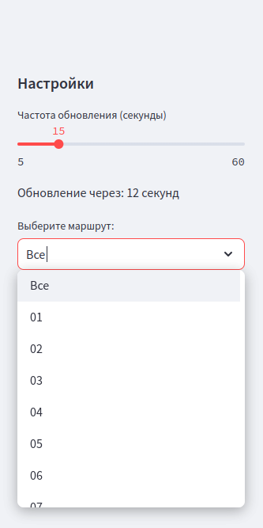
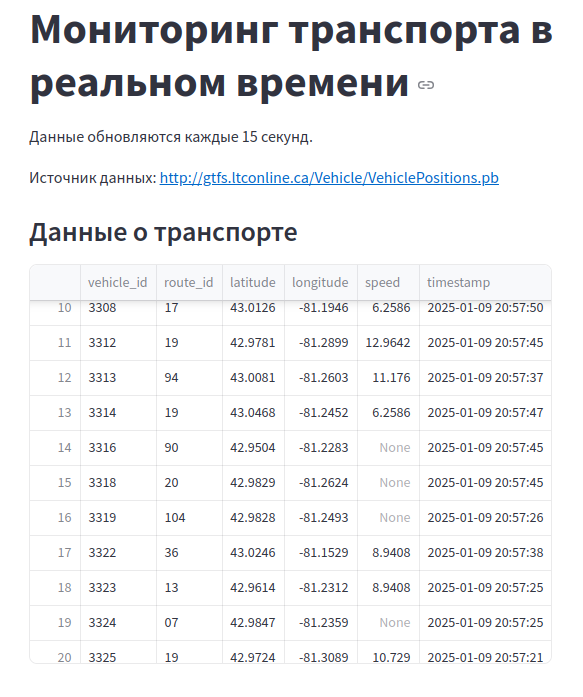
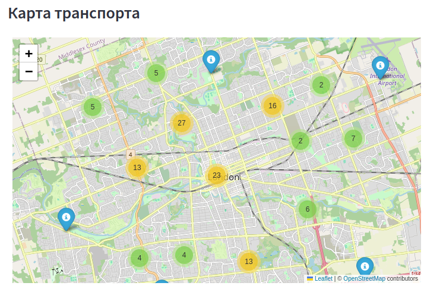
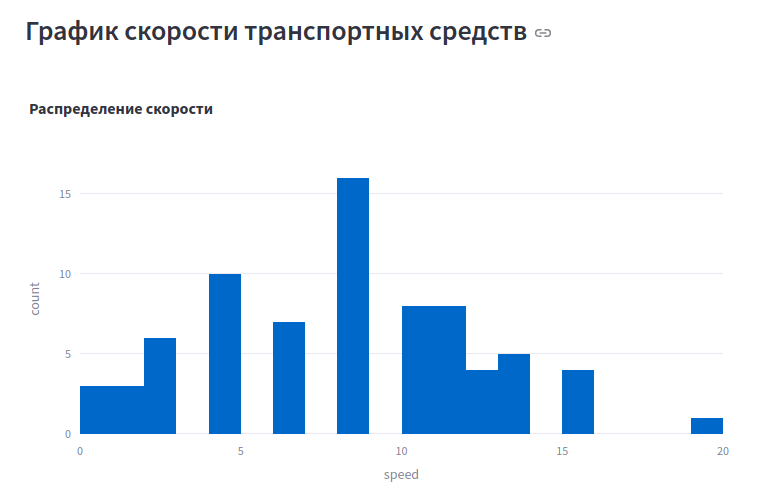

# Real-Time Transit Monitor 🚍

Real-Time Transit Monitor is a Python-based web application built using Streamlit that provides live updates on public transportation. It allows users to view real-time vehicle positions, filter data by route, and analyze speed distributions through a dynamic interface.

---

## Features 🌟

- **Live Vehicle Monitoring**: Displays real-time positions of public transit vehicles on an interactive map.
- **Route Filtering**: Enables users to filter data by specific routes.
- **Speed Analysis**: Provides a histogram of vehicle speeds for data analysis.
- **Customizable Refresh Rate**: Users can set the refresh rate for data updates (5–60 seconds).
- **Logging**: Logs application activity to monitor performance and debug issues.

---

## Project Structure 📂

```
RealTimeTransitMonitor/
├── .venv/               # Virtual environment (excluded from repo)
├── data/                # Directory for data files (excluded from repo)
├── logs/                # Directory for log files (automatically managed)
├── gtfs-realtime.proto  # Protobuf schema for GTFS-RT data
├── gtfs_realtime_pb2.py # Generated Python module from protobuf schema
├── vehicle_dashboard.py # Main application script
├── requirements.txt     # Python dependencies
├── README.md            # Project description (this file)
└── .gitignore           # Git ignore file
```

---

## Installation 🛠️

### Prerequisites
- Python 3.8 or higher

### Steps
1. Clone the repository:
   ```bash
   git clone https://github.com/yourusername/RealTimeTransitMonitor.git
   cd RealTimeTransitMonitor
   ```

2. Create and activate a virtual environment:
   ```bash
   python -m venv .venv
   source .venv/bin/activate  # On Windows: .venv\Scripts\activate
   ```

3. Install dependencies:
   ```bash
   pip install -r requirements.txt
   ```

4. Run the application:
   ```bash
   streamlit run vehicle_dashboard.py
   ```

---

## Usage 🚀

1. Open the application in your web browser (default: http://localhost:8501).
2. Adjust settings in the sidebar:
   - Set the refresh rate for data updates.
   - Select a specific route to filter data.
3. Explore the live map, data table, and speed histogram.

---

## Logs 🗂️

- Logs are stored in the `logs/` directory.
- The application keeps the last 5 log files and automatically deletes older ones.

---

## Notes 📝

- The `logs/` and `data/` directories are excluded from version control via `.gitignore`.
- Dependencies are listed in `requirements.txt`.
- The protobuf schema (`gtfs-realtime.proto`) is used to generate the `gtfs_realtime_pb2.py` file.

---

## Contribution 🤝

Contributions are welcome! Please fork the repository and submit a pull request.

---

## License 📜

This project is licensed under the MIT License. See the LICENSE file for details.

---

## Acknowledgements 🙌

- [Streamlit](https://streamlit.io) for the interactive web interface.
- [GTFS Realtime](https://gtfs.org/realtime/) for the data format and schema.
- [Folium](https://python-visualization.github.io/folium/) for map visualization.
- [Plotly](https://plotly.com/) for dynamic charting.

---

Happy Monitoring! 🚍

---

# Real-Time Transit Monitor (на русском) 🚍

Real-Time Transit Monitor — это веб-приложение на Python, созданное с использованием Streamlit. Оно предоставляет обновления о движении общественного транспорта в реальном времени, позволяет отображать позиции транспортных средств, фильтровать данные по маршрутам и анализировать распределение скоростей.

---

## Особенности 🌟

- **Мониторинг транспорта в реальном времени**: отображение позиций транспортных средств на интерактивной карте.
- **Фильтрация по маршрутам**: возможность фильтровать данные по определённым маршрутам.
- **Анализ скоростей**: гистограмма скоростей для анализа данных.
- **Настраиваемая частота обновления**: пользователи могут устанавливать частоту обновления данных (от 5 до 60 секунд).
- **Логирование**: записи активности приложения для мониторинга и отладки.

---

## Структура проекта 📂

```
RealTimeTransitMonitor/
├── .venv/               # Виртуальное окружение (не добавляется в репозиторий)
├── data/                # Директория для файлов данных (не добавляется в репозиторий)
├── logs/                # Директория для логов (управляется автоматически)
├── gtfs-realtime.proto  # Протобуф-схема для данных GTFS-RT
├── gtfs_realtime_pb2.py # Сгенерированный Python-модуль из протобуф-схемы
├── vehicle_dashboard.py # Основной скрипт приложения
├── requirements.txt     # Зависимости Python
├── README.md            # Описание проекта (этот файл)
└── .gitignore           # Файл исключений для Git
```

---

## Установка 🛠️

### Требования
- Python 3.8 или выше

### Шаги
1. Клонируйте репозиторий:
   ```bash
   git clone https://github.com/yourusername/RealTimeTransitMonitor.git
   cd RealTimeTransitMonitor
   ```

2. Создайте и активируйте виртуальное окружение:
   ```bash
   python -m venv .venv
   source .venv/bin/activate  # На Windows: .venv\Scripts\activate
   ```

3. Установите зависимости:
   ```bash
   pip install -r requirements.txt
   ```

4. Запустите приложение:
   ```bash
   streamlit run vehicle_dashboard.py
   ```

---

## Использование 🚀

1. Откройте приложение в браузере (по умолчанию: http://localhost:8501).
2. Настройте параметры в боковой панели:
   - Установите частоту обновления данных.
   - Выберите маршрут для фильтрации данных.
3. Исследуйте карту, таблицу данных и гистограмму скоростей.

---

## Логи 🗂️

- Логи сохраняются в директорию `logs/`.
- Приложение сохраняет последние 5 файлов логов и автоматически удаляет старые.

---

## Примечания 📝

- Директории `logs/` и `data/` исключены из системы контроля версий с помощью `.gitignore`.
- Зависимости перечислены в файле `requirements.txt`.
- Протобуф-схема (`gtfs-realtime.proto`) используется для генерации файла `gtfs_realtime_pb2.py`.

---

## Вклад 🤝

Будем рады вашему вкладу! Сделайте форк репозитория и отправьте pull request.

---

## Лицензия 📜

Этот проект распространяется под лицензией MIT. Подробнее см. файл LICENSE.

---

## Благодарности 🙌

- [Streamlit](https://streamlit.io) за интерактивный веб-интерфейс.
- [GTFS Realtime](https://gtfs.org/realtime/) за формат данных и схему.
- [Folium](https://python-visualization.github.io/folium/) за визуализацию карт.
- [Plotly](https://plotly.com/) за динамическое построение графиков.

---

## Screenshots 📸

### Settings Panel


### Transport Data Table


### Transport Map


### Speed Chart



Приятного мониторинга! 🚍
